# RegMind 🧠
### Autonomous Regulatory Nerve System for Banks

> **Hackathon Submission** · Theme: Agentic Regulatory Intelligence & Compliance

RegMind is a multi-agent AI system that autonomously ingests, interprets, routes, and validates compliance actions across a bank's departments — turning regulatory circulars into closed, audited action items without human intervention.

---

## The Problem

Banks today process regulatory changes manually. Compliance officers read RBI/SEBI circulars, interpret them, route emails to departments, and chase completion. This is:

- **Slow** — days between a circular dropping and action being assigned
- **Error-prone** — a missed circular can mean penalties or systemic risk
- **Unauditable** — no structured trail of who was assigned what and when

---

## The Solution

RegMind is a **regulatory nervous system** — five autonomous agents, each with one job, forming a closed loop from circular to verified completion.

```
Regulatory Sources → RegWatcher → MapMaker → RouteMaster → Departments
                                                                  ↓
                    RegBoard ← ← ← ← ← ← ← ← ← AuditEye ← Evidence
```

---

## Agent Architecture

## System Architecture


## RouteMaster Flow


### Agent 1 — RegWatcher (Ingestion)
Continuously monitors RBI, SEBI, IBA, IRDAI, and Basel Committee via RSS feeds, web scraping, and API hooks. Triggers the pipeline the moment a new circular is detected.

### Agent 2 — MapMaker (Interpretation)
Uses an LLM to parse regulatory documents and decompose them into structured **Measurable Action Points (MAPs)**:

| Field | Description |
|---|---|
| `what` | The specific action required |
| `who` | Responsible department |
| `by_when` | Deadline derived from circular |
| `how_verified` | Evidence/proof criteria |

### Agent 3 — RouteMaster (Assignment)
Assigns each MAP to the correct department using a 3-layer decision process:

1. **Vector similarity** — MAP text vs department capability profiles (cosine similarity)
2. **Org-graph rules** — deterministic tag → department mappings (e.g. `AML/KYC` → Compliance)
3. **LLM arbitration** — for ambiguous cases; reasoning stored for audit trail

Auto-creates tickets in JIRA/ServiceNow with SLA and escalation rules.

### Agent 4 — AuditEye (Validation)
When a department marks a MAP complete, AuditEye autonomously validates the submitted evidence using document AI, cross-referenced against the original MAP criteria. Closes verified MAPs; escalates failures with a reason.

### Agent 5 — RegBoard (Insights)
Real-time executive dashboard showing:
- Compliance posture across departments
- Overdue MAPs and SLA breaches
- Department-wise completion rates
- Predicted regulatory risk exposure

---

## What Makes This Unique

| Feature | Traditional Tools | RegMind |
|---|---|---|
| Regulatory monitoring | Manual / alert-based | Autonomous, real-time |
| Action decomposition | Human interpretation | LLM → structured MAPs |
| Department routing | Email / manual | 3-layer intelligent routing |
| Completion validation | Manual sign-off | Autonomous evidence verification |
| Audit trail | Fragmented | Every MAP has a closed chain |

**MAP atomicity** is the core innovation — every regulatory change becomes an indivisible unit of work with a full lifecycle: created → assigned → completed → validated → closed. Nothing falls through the cracks.

---

## Tech Stack

| Layer | Technology |
|---|---|
| Agent orchestration | LangGraph + Claude API |
| LLM | Claude Sonnet (Anthropic) |
| Vector DB | Pinecone |
| Document parsing | OCR pipeline (Tesseract + PyMuPDF) |
| Ticketing integration | JIRA REST API / ServiceNow API |
| Backend | Python (FastAPI) |
| Frontend dashboard | React + Recharts |
| Regulatory monitoring | RSS + web scraping (BeautifulSoup) |

---

## System Flow

**Overall pipeline:**

```
RBI / SEBI / IBA
       ↓
  RegWatcher  ←── monitors continuously
       ↓
  MapMaker    ←── circular → structured MAPs
       ↓
  RouteMaster ←── vector sim + rules + LLM
       ↓
  Departments ←── auto-assigned JIRA tickets
       ↓
  AuditEye    ←── validates submitted evidence
       ↓
  RegBoard    ←── live compliance dashboard
```

**RouteMaster decision flow:**

```
MAP received
     ↓
Layer 1: Vector similarity (MAP vs dept. profiles)
     ↓
Layer 2: Org-graph rule engine (tag → dept. mapping)
     ↓
High confidence? ──yes──→ Assign directly
     ↓ no
Layer 3: LLM arbitration + justification stored
     ↓
JIRA/ServiceNow ticket created with SLA
```

---

## Impact

- **~70% reduction** in manual compliance workload
- **Hours instead of days** for regulatory response time
- **Full audit trail** — every MAP has a verifiable chain of evidence
- **Zero missed obligations** — MAP atomicity ensures nothing is lost
- Scales across RBI, SEBI, IRDAI, Basel, and IBA simultaneously

---

## Project Structure

```
regmind/
├── agents/
│   ├── regwatcher.py       # Regulatory source monitoring
│   ├── mapmaker.py         # Circular → MAP decomposition
│   ├── routemaster.py      # 3-layer MAP assignment
│   ├── auditeye.py         # Evidence validation
│   └── regboard.py         # Dashboard data aggregation
├── config/
│   └── org_graph.json      # Department capability profiles + rules
├── integrations/
│   ├── jira_client.py
│   └── servicenow_client.py
├── frontend/               # React dashboard
├── docs/
│   └── architecture.md
└── README.md
```

---

## Team

> JASS · 2026

---

*RegMind — because regulators don't wait, and neither should compliance.*
